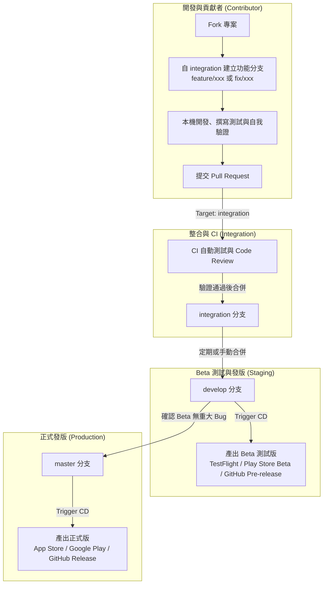

# 中山校務通（NSYSU AP）貢獻指南

非常感謝你對中山校務通（NSYSU AP）的關注！無論是貢獻新功能、修正錯誤、改善使用體驗，或是更新文件，我們都非常歡迎。這份指南將會帶你了解本專案的架構、開發環境設定，以及從開發到發版的完整協作與維護工作流。

## 1. 專案技術棧與環境

在開始貢獻之前，請先確保你的開發環境符合以下需求：

- **前端框架**：Flutter (遵照 `.fvmrc` 中的版本)
- **程式語言**：Dart
- **共用套件**：依賴於 [`ap_common`](https://github.com/abc873693/ap_common) 系列套件（負責校務通系列共用的介面與核心邏輯）。

## 2. 分支策略與維護流程

為了確保程式碼品質與穩定的發版節奏，本專案採用三層核心分支架構：`integration`、`develop` 與 `master`。

### 開發者貢獻＋維護與發版協作流程圖



### 核心分支說明

| 分支 | 職責與用途 | CI / CD 行為 |
| ------ | ----------- | ------------ |
| **`integration`** | **PR 唯一合併目標**。作為緩衝區，收集並整合所有開發者的提交，確保基本編譯與測試通過。 | 執行 CI（`flutter analyze`, `flutter test`），**無**自動發版 (CD) 行為。 |
| **`develop`** | **Beta 測試版發行分支**。當 `integration` 累積一定功能後合併至此，供測試人員與社群進行封閉/公開測試。 | 執行 CI/CD，自動打包並發布 **Beta** 版本。 |
| **`master`** | **正式穩定版分支**。`develop` 測試無誤後合併至此，對應線上使用者的正式版本。 | 執行 CI/CD，自動打包並發布 **穩定(Stable)** 版本。 |

## 3. 貢獻工作流 (Step-by-Step)

### Step 1: 建立 Issue 與 Fork 專案

1. 在動手修改前，建議先在 [Issues 區](https://github.com/nsysu-code-club/NSYSU-AP/issues) 尋找或建立一個 Issue 討論你的想法或回報錯誤。
2. 點擊 GitHub 右上角的 `Fork` 將專案複製到你的帳號下。

### Step 2: 建立開發分支

將 Fork 的專案 clone 到本機後，**請務必從 `integration` 分支切出你的開發分支**：

```bash
git fetch origin
git checkout integration
git checkout -b <type>/<issue-name>
```

**分支命名規範**：

- `feature/xxx`：開發新功能
- `fix/xxx`：修正 Bug
- `refactor/xxx`：重構程式碼
- `chore/xxx`：工具設定、依賴更新或不影響原始碼的維護

### Step 3: 開發與提交

1. 進行程式碼修改。
2. 盡量保持每個 Commit 的獨立性，並建議使用語意化（Semantic）的 Commit 訊息（例如：`feat(UI): 增加首頁跑馬燈`、`fix(selcrs): 修正課表無法滑動的問題`）。
3. 提交前，請在本機執行以下檢查確保程式碼品質：

   ```bash
   # 確保依賴完整
   flutter pub get
   # 檢查是否有語法錯誤、排版或警告
   flutter analyze
   # 執行單元或 Widget 測試
   flutter test
   ```

### Step 4: 提交 Pull Request (PR)

1. 將分支 Push 到你的 GitHub 帳號。
2. 建立 Pull Request，**目標分支 (Base) 請務必選擇 `integration`**。
3. **PR 撰寫建議**：
   - 請先確認 [CheckList](#4-提交前-checklist) 項目，確保 PR 符合基本要求。
   - 建議使用中文，加速審核流程。
   - 每次 PR 盡量只處理一個主題，讓 review 更容易。
   - 清單化列出修改的問題、實作內容與驗證方式。
   - 若是 **UI 調整，強烈建議附上截圖或螢幕錄影**，並說明為什麼要進行這個修正，這能讓 Reviewer 快速理解。
   - 若功能尚在開發中，不希望 Maintainer 直接介入，可以將 PR 設為 **Draft（草稿）**。此時 CI 依然會執行幫助你驗證，直到開發完成後再點擊 "Ready for review"。
4. 參與 Code Review，根據 Maintainer 的回饋進行修正，直到 PR 被合併。

## 4. 提交前 Checklist

在發送 PR 或將草稿轉換為 Ready for review 前，請快速核對以下項目：

- [ ] 開發分支是否基於 `integration` 建立？且 PR 的目標分支為 `integration`？
- [ ] 是否已在本機執行 `flutter analyze` 且無任何錯誤？
- [ ] 程式碼是否乾淨，沒有誤改無關的檔案？
- [ ] PR 說明是否足夠詳盡，並附上必要的截圖/錄影？
- [ ] 若有對應功能變更，是否已更新/新增測試？

再次感謝你花時間閱讀並遵守這份指南，期待你的貢獻讓中山校務通變得更好！
