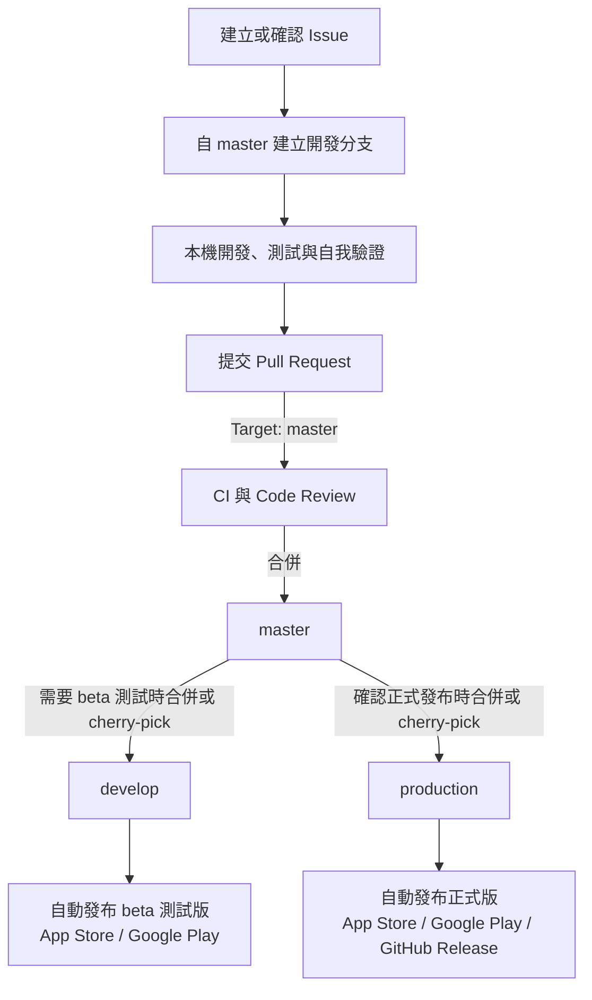

# 中山校務通（NSYSU AP）貢獻指南

非常感謝你對中山校務通（NSYSU AP）的關注！無論是貢獻新功能、修正錯誤、改善使用體驗，或是更新文件，我們都非常歡迎。這份指南會帶你了解本專案的開發環境、分支策略，以及從 Issue、開發、Pull Request 到發版的協作流程。

## 1. 專案技術棧與環境

在開始貢獻之前，請先確保你的開發環境符合以下需求：

- **前端框架**：Flutter，版本遵照專案根目錄的 `.fvmrc`
- **程式語言**：Dart
- **共用套件**：依賴於 [`ap_common`](https://github.com/abc873693/ap_common) 系列套件，負責校務通系列共用的介面與核心邏輯

建議使用 FVM 進行 Flutter 版本管理，並在開始開發前先執行：

```bash
flutter pub get
```

## 2. Issue 與分支原則

所有變更在開始前都應該先有對應的 Issue。這能讓討論、設計取捨、實作分支與 PR 都有清楚的追蹤來源。

- 若是新功能、Bug fix、重構、文件更新或維護工作，請先尋找既有 Issue；沒有合適的 Issue 時，請先建立新的 Issue。
- 如果是從 Issue 開始開發，建議使用 GitHub Issue 右側的 **Development -> Create a branch** 建立分支，GitHub 會自動把分支和 Issue 關聯起來。
- 如果分支已經先建立，請在 PR 說明中標註對應 Issue，例如 `Related to #42`；若 PR 合併後應自動關閉 Issue，可使用 `Fixes #42` 或 `Closes #42`。

## 3. 分支策略與發版流程

本專案目前以 `master` 作為所有開發工作的基準分支與主要合併目標，並使用 `develop` 與 `production` 進行 beta 與正式版發布。

### 分支角色

| 分支 | 職責與用途 | CI / CD 行為 |
| ------ | ----------- | ------------ |
| **`master`** | 所有功能、Bug fix、重構、文件與維護工作的 base branch。一般開發分支都從 `master` 切出，完成後也合併回 `master`。 | 執行 CI，用於確認主要分支的程式碼品質與可建置性。 |
| **`develop`** | Beta 測試分支。當 commit 或 merge 進入 `develop`，會直接推送到 App Store / Google Play 的 beta 測試流程。 | 執行 CI/CD，自動打包並發布 beta 測試版本。 |
| **`production`** | 正式版發布分支。確認要對外正式發布時，才將已驗證內容推進此分支。 | 執行正式版 CD，自動打包並發布正式版本。 |

### 開發與發布流程圖


```mermaid
flowchart TD
    A[建立或確認 Issue] --> B[自 master 建立開發分支]
    B --> C[本機開發、測試與自我驗證]
    C --> D[提交 Pull Request]
    D -->|Target: master| E[CI 與 Code Review]
    E -->|合併| F[master]
    F -->|需要 beta 測試時合併或 cherry-pick| G[develop]
    G --> H[自動發布 beta 測試版\nApp Store / Google Play]
    F -->|確認正式發布時合併或 cherry-pick| I[production]
    I --> J[自動發布正式版\nApp Store / Google Play / GitHub Release]
```

## 4. 貢獻工作流

### Step 1: 建立 Issue 與 Fork 專案

1. 在動手修改前，請先到 [Issues 區](https://github.com/nsysu-code-club/NSYSU-AP/issues) 尋找或建立 Issue，描述你想修正的問題或想新增的功能。
2. 點擊 GitHub 右上角的 `Fork` 將專案複製到你的帳號下。

### Step 2: 建立開發分支

將 Fork 的專案 clone 到本機後，請從 `master` 切出你的開發分支：

```bash
git fetch origin
git checkout master
git pull origin master
git checkout -b <type>/<issue-name>
```

分支命名格式維持既有規則：

- `feature/xxx`：開發新功能
- `fix/xxx`：修正 Bug
- `refactor/xxx`：重構程式碼
- `chore/xxx`：工具設定、依賴更新或不影響原始碼的維護

### Step 3: 開發與提交

1. 進行程式碼修改。
2. 盡量保持每個 commit 的獨立性，並建議使用語意化 commit 訊息，例如 `feat(UI): 增加首頁跑馬燈`、`fix(selcrs): 修正課表無法滑動的問題`。
3. 提交前，請在本機執行以下檢查：

   ```bash
   flutter pub get
   flutter analyze
   flutter test
   ```

4. 如果修改了 `lib/l10n/*.json` 翻譯檔，請重新產生 l10n 程式碼：

   ```bash
   dart run slang
   ```

5. 若修改的是 `packages/nsysu_crawler`，也請視情況執行該 package 的分析與測試：

   ```bash
   cd packages/nsysu_crawler
   dart pub get
   dart analyze
   dart test -r expanded
   ```

### Step 4: 提交 Pull Request

1. 將分支 push 到你的 GitHub 帳號。
2. 建立 Pull Request，目標分支（base）請選擇 `master`。
3. PR 說明請包含：
   - 對應 Issue，例如 `Related to #42`、`Fixes #42`
   - 修改內容摘要
   - 驗證方式，例如執行過哪些指令或測試
   - 若是 UI 調整，請附上截圖或螢幕錄影，並說明調整原因
4. 每次 PR 盡量只處理一個主題，讓 review 更容易。
5. 若功能尚在開發中，不希望 Maintainer 直接介入，可以將 PR 設為 Draft。CI 仍會執行，等開發完成後再改成 Ready for review。
6. 參與 Code Review，根據 Maintainer 的回饋進行修正，直到 PR 被合併。

## 5. 發布注意事項

- 一般開發不應直接推到 `develop` 或 `production`。
- `develop` 是 beta 測試分支；任何 commit 或 merge 進入後，都會直接進入 App Store / Google Play 的 beta 測試發布流程。
- `production` 是正式版發布分支；只有確認要正式對外發布的內容才應推進此分支。
- 發布前請確認版本號、changelog、release note、平台金鑰與必要設定都已準備完成。

## 6. 提交前 Checklist

在發送 PR 或將 Draft 轉換為 Ready for review 前，請快速核對以下項目：

- [ ] 是否已建立或關聯對應 Issue？
- [ ] 開發分支是否基於 `master` 建立？PR 目標分支是否為 `master`？
- [ ] 分支命名是否符合既有格式，例如 `feature/xxx`、`fix/xxx`、`refactor/xxx`、`chore/xxx`？
- [ ] 是否已在本機執行 `flutter analyze` 且無錯誤？
- [ ] 是否已視需要執行 `flutter test` 或 `dart test`？
- [ ] 若修改 l10n 翻譯檔，是否已執行 `dart run slang`？
- [ ] 程式碼是否乾淨，沒有誤改無關檔案？
- [ ] PR 說明是否足夠詳盡，並附上必要的截圖或錄影？
- [ ] 若有對應功能變更，是否已更新或新增測試？

再次感謝你花時間閱讀並遵守這份指南，期待你的貢獻讓中山校務通變得更好！
